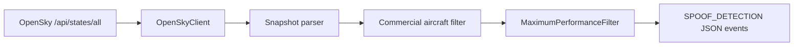

# AeroGuardian-Core

[](https://www.python.org/downloads/)
[](https://github.com/ravi923615/AeroGuardian-Core/stargazers)

AeroGuardian-Core is an open-source framework designed to enhance the resilience of the National Airspace System by detecting kinematic and temporal anomalies in automated flight management networks.

The project combines live OpenSky state-vector screening, timing-integrity validation, and flight-plan import hardening so researchers and security engineers can evaluate how spoofing, replay, delay injection, and unsafe file ingestion could affect aviation automation workflows.

Security disclosures are handled through [SECURITY.md](SECURITY.md). Downstream research and reuse are permitted under the [MIT License](LICENSE).

## Mission Focus

- Uses live OpenSky state vectors instead of static samples.
- Maps each defensive control to a concrete aviation-cybersecurity attack surface.
- Keeps the logic compact enough to audit while leaving room for deeper ADS-B, FMS, and navigation-integrity analytics.

## Security Architecture

| Module | Control objective | Attack vector mitigated |
| --- | --- | --- |
| [`src/aeroguardian/detector.py`](src/aeroguardian/detector.py) | Flags impossible commercial-aircraft kinematics from live state vectors. | Spoofed or corrupted surveillance data that produces implausible performance excursions. |
| [`src/aeroguardian/latency_monitor.py`](src/aeroguardian/latency_monitor.py) | Compares sensor and server arrival timing, sustained jitter, and out-of-order samples. | Man-in-the-Middle delay injection, buffering, and timing manipulation. |
| [`src/aeroguardian/temporal_validator.py`](src/aeroguardian/temporal_validator.py) | Validates clock-delta stability and sawtooth replay patterns in historical timing data. | Replay attacks and delayed traffic reinjection. |
| [`src/aeroguardian/import_sanitizer.py`](src/aeroguardian/import_sanitizer.py) | Audits imported flight-plan paths and simulates sandboxed writes restricted to `/flight_plans/`. | Path traversal and unauthorized file overwrite attempts during flight-plan ingestion. |
| [`src/aeroguardian/buffer_validator.py`](src/aeroguardian/buffer_validator.py) | Enforces ARINC 424 fixed-column (132-char) and ARINC 429 32-bit word-width limits during navigation record parsing. | Buffer overflow attacks against RTOS-hosted FMS parsers during data ingestion. |

## Kinematic Detection Logic

The current maximum-performance filter flags a commercial aircraft when either of these conditions is met:

1. Absolute vertical rate exceeds `6000 fpm`.
2. Ground speed changes by more than `50 knots` inside a single observed `2 second` update without a matching maneuver proxy.

`SPOOF_DETECTION` is emitted as JSON with the triggering metrics so downstream systems can log, route, or enrich the alert.

The repository also includes a timing-focused `LatencyMonitor` for server-vs-sensor arrival analysis. It flags a potential `MITM_DELAY_ATTACK` when packet-delay jitter exceeds `200 ms` for a configurable number of consecutive observations.

## Quickstart

```bash
git clone https://github.com/ravi923615/AeroGuardian-Core.git
cd AeroGuardian-Core
PYTHONPATH=src python3 scripts/pull_live_state_vectors.py --interval 5 --iterations 3
```

Authenticated access is recommended for better rate limits and finer resolution:

```bash
export OPENSKY_CLIENT_ID="your_client_id"
export OPENSKY_CLIENT_SECRET="your_client_secret"
PYTHONPATH=src python3 scripts/pull_live_state_vectors.py --interval 5 --iterations 3
```

## Example output

Representative output from the monitor looks like this:

```json
{"snapshot_time":1713491402,"state_count":7342,"commercial_count":2128,"rate_limit_remaining":"397"}
{"code":"SPOOF_DETECTION","icao24":"a1b2c3","callsign":"DAL204 ","observed_at":1713491402.381,"reason":"Commercial aircraft vertical rate exceeded maximum-performance threshold.","metrics":{"vertical_rate_fpm":6432.15,"threshold_fpm":6000.0}}
{"code":"SPOOF_DETECTION","icao24":"d4e5f6","callsign":"UAL991 ","observed_at":1713491404.214,"reason":"Commercial aircraft ground speed changed abruptly without a matching maneuver proxy.","metrics":{"ground_speed_delta_knots":57.81,"threshold_knots":50.0,"observed_delta_seconds":1.833}}
```

## System Overview



Runtime plumbing:

- [`src/aeroguardian/opensky_client.py`](src/aeroguardian/opensky_client.py) handles OpenSky authentication and polling.
- [`src/aeroguardian/cli.py`](src/aeroguardian/cli.py) runs the polling loop and prints JSON output.
- [`src/aeroguardian/latency_cli.py`](src/aeroguardian/latency_cli.py) provides a command-line interface for historical timing analysis.
- [`scripts/import_sanitizer.py`](scripts/import_sanitizer.py) runs the file-integrity audit and sandbox simulator from the shell.

## Important OpenSky constraints

According to the current official OpenSky REST docs:

- Authenticated state-vector requests have roughly `5 second` resolution.
- Anonymous state-vector requests have roughly `10 second` resolution.
- The official state-vector schema does not expose aircraft pitch.

Because pitch is not available, the second spoofing rule uses an explicit proxy: a speed spike is only flagged when `true_track` and `vertical_rate` stay nearly unchanged between consecutive observations. That keeps the implementation aligned with the published schema while preserving the intent of "no matching pitch change."

For the latency monitor, the current public `pyopensky` 2.16 schema exposes exact `timeatserver` and `timeatsensor` fields on `FlarmRaw`. The historical ADS-B raw tables expose `mintime` and `maxtime` instead. The implementation uses the exact server-vs-sensor timestamps when available and keeps that distinction explicit rather than treating the ADS-B timing bounds as identical semantics.

## CLI usage

```bash
PYTHONPATH=src python3 -m aeroguardian.cli --help
```

```text
--interval INTERVAL          Polling interval in seconds
--iterations ITERATIONS      Number of polling cycles. Zero means run forever
--icao24 ICAO24              Filter to one or more ICAO24 addresses
--bbox LAMIN LOMIN LAMAX LOMAX
                             Restrict the query to a latitude/longitude bounding box
--no-extended                Skip the extended category field
```

## Latency Monitor Usage

```python
from aeroguardian.latency_monitor import LatencyMonitor

monitor = LatencyMonitor()
frame = monitor.fetch_server_sensor_times(
    start="2025-01-01 00:00:00Z",
    stop="2025-01-01 00:15:00Z",
    sensor_name="my-sensor",
)
alerts = monitor.analyze_frame(frame)
for alert in alerts:
    print(alert.to_dict())
```

The default logic computes:

1. `delay_ms = time_at_server - time_at_sensor`
2. `jitter_ms = abs(current_delay_ms - previous_delay_ms)`
3. A `MITM_DELAY_ATTACK` alert when `jitter_ms > 200` for `3` consecutive observations

You can also run it directly as a CLI:

```bash
PYTHONPATH=src python3 scripts/monitor_latency_jitter.py \
  --start "2025-01-01T00:00:00Z" \
  --stop "2025-01-01T00:15:00Z" \
  --sensor-name "my-sensor"
```

Or, once the package is installed:

```bash
aeroguardian-latency-monitor \
  --start "2025-01-01T00:00:00Z" \
  --stop "2025-01-01T00:15:00Z" \
  --sensor-name "my-sensor"
```

The CLI emits a JSON summary first, followed by one JSON line per alert.

## Temporal Validator Usage

```bash
PYTHONPATH=src python3 scripts/temporal_validator.py \
  --start "2025-01-01T00:00:00Z" \
  --stop "2025-01-01T00:15:00Z"
```

The temporal validator detects unstable `delta_t` drift and sawtooth timing resets that are consistent with replay-style traffic injection windows.

## Flight Plan Import Hardening

```bash
PYTHONPATH=src python3 scripts/import_sanitizer.py "%2e%2e%2fetc/passwd" \
  --simulate-write \
  --sandbox-root /tmp/aeroguardian-demo
```

The sanitizer repeatedly decodes imported file paths, blocks parent-directory and absolute-path escapes, and appends a JSON audit event whenever a simulated importer attempts to write outside the `/flight_plans/` sandbox.

## RTOS Memory Sandbox — Buffer Integrity

```bash
PYTHONPATH=src python3 scripts/buffer_integrity_test.py
PYTHONPATH=src python3 scripts/buffer_integrity_test.py --verbose
PYTHONPATH=src python3 scripts/buffer_integrity_test.py --record "YOUR_RAW_ARINC_424_RECORD"
```

The buffer-integrity test feeds ARINC 424 navigation records into a fixed-width buffer parser that enforces the 132-character record limit and the ARINC 429 32-bit (4-byte) word boundary. Records that exceed these limits produce a structured `SecurityException` rather than crashing — simulating the memory-safety discipline required in RTOS-hosted FMS software.

## Local verification

```bash
PYTHONPATH=src python3 -m unittest discover -s tests
PYTHONPYCACHEPREFIX=/tmp/aeroguardian-pyc python3 -m compileall src tests scripts
```

## Roadmap

- Add richer anomaly scoring beyond a single threshold filter.
- Stream detections into a persistent sink or API.
- Compare neighboring aircraft behavior to reduce false positives.
- Add replay mode for archived OpenSky samples and repeatable benchmarks.
- Explore additional resilience features around track jumps, altitude discontinuities, and impossible kinematics.

## Contributing

Ideas, issues, and improvements are welcome. Start with [CONTRIBUTING.md](CONTRIBUTING.md) if you want to extend the detector, improve the analytical workflow, or strengthen the project's contribution to aviation-system resilience.

If you identify a security issue, follow [SECURITY.md](SECURITY.md) instead of opening a public issue.

Good first areas:

- More realistic commercial-aircraft classification.
- Better false-positive suppression.
- Structured logging, storage, or alerting integrations.
- Documentation and validation workflow enhancements.

## Search keywords

This repository may be useful if you are looking for: `OpenSky`, `ADS-B`, `aviation cybersecurity`, `flight tracking`, `state vectors`, `aircraft anomaly detection`, `National Airspace System resilience`, or `Python aviation monitoring`.

## References

- [OpenSky API landing page](https://opensky-network.org/data/api)
- [OpenSky REST API docs](https://openskynetwork.github.io/opensky-api/rest.html)
- [OpenSky FAQ authentication guidance](https://opensky-network.org/about/faq)

## License

This repository is released under the [MIT License](LICENSE).
