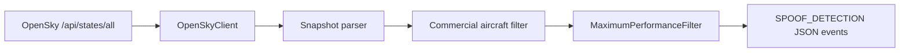

# AeroGuardian-Core

[](https://www.python.org/downloads/)
[](https://github.com/ravi923615/AeroGuardian-Core/stargazers)

Live OpenSky Network state-vector monitoring for spotting suspicious aircraft performance anomalies in commercial traffic.

AeroGuardian-Core polls real-time aircraft state vectors, keeps short-lived per-aircraft history, and emits `SPOOF_DETECTION` events when an aircraft appears to violate a simple maximum-performance sanity filter.

## Why this is interesting

- Uses live OpenSky state vectors instead of static samples.
- Focuses on an aviation-security flavored detection problem that is easy to demo and extend.
- Keeps the logic small enough to audit while leaving room for stronger ADS-B and spoofing heuristics later.

## Detection logic

The current maximum-performance filter flags a commercial aircraft when either of these conditions is met:

1. Absolute vertical rate exceeds `6000 fpm`.
2. Ground speed changes by more than `50 knots` inside a single observed `2 second` update without a matching maneuver proxy.

`SPOOF_DETECTION` is emitted as JSON with the triggering metrics so downstream systems can log, route, or enrich the alert.

## Quickstart

```bash
git clone https://github.com/ravi923615/AeroGuardian-Core.git
cd AeroGuardian-Core
PYTHONPATH=src python3 scripts/pull_live_state_vectors.py --interval 5 --iterations 3
```

Authenticated access is recommended for better rate limits and finer resolution:

```bash
export OPENSKY_CLIENT_ID="your_client_id"
export OPENSKY_CLIENT_SECRET="your_client_secret"
PYTHONPATH=src python3 scripts/pull_live_state_vectors.py --interval 5 --iterations 3
```

## Example output

Representative output from the monitor looks like this:

```json
{"snapshot_time":1713491402,"state_count":7342,"commercial_count":2128,"rate_limit_remaining":"397"}
{"code":"SPOOF_DETECTION","icao24":"a1b2c3","callsign":"DAL204 ","observed_at":1713491402.381,"reason":"Commercial aircraft vertical rate exceeded maximum-performance threshold.","metrics":{"vertical_rate_fpm":6432.15,"threshold_fpm":6000.0}}
{"code":"SPOOF_DETECTION","icao24":"d4e5f6","callsign":"UAL991 ","observed_at":1713491404.214,"reason":"Commercial aircraft ground speed changed abruptly without a matching maneuver proxy.","metrics":{"ground_speed_delta_knots":57.81,"threshold_knots":50.0,"observed_delta_seconds":1.833}}
```

## How it works



Core code paths:

- [`src/aeroguardian/opensky_client.py`](src/aeroguardian/opensky_client.py) handles OpenSky authentication and polling.
- [`src/aeroguardian/detector.py`](src/aeroguardian/detector.py) applies the maximum-performance rules.
- [`src/aeroguardian/cli.py`](src/aeroguardian/cli.py) runs the polling loop and prints JSON output.

## Important OpenSky constraints

According to the current official OpenSky REST docs:

- Authenticated state-vector requests have roughly `5 second` resolution.
- Anonymous state-vector requests have roughly `10 second` resolution.
- The official state-vector schema does not expose aircraft pitch.

Because pitch is not available, the second spoofing rule uses an explicit proxy: a speed spike is only flagged when `true_track` and `vertical_rate` stay nearly unchanged between consecutive observations. That keeps the implementation aligned with the published schema while preserving the intent of "no matching pitch change."

## CLI usage

```bash
PYTHONPATH=src python3 -m aeroguardian.cli --help
```

```text
--interval INTERVAL          Polling interval in seconds
--iterations ITERATIONS      Number of polling cycles. Zero means run forever
--icao24 ICAO24              Filter to one or more ICAO24 addresses
--bbox LAMIN LOMIN LAMAX LOMAX
                             Restrict the query to a latitude/longitude bounding box
--no-extended                Skip the extended category field
```

## Local verification

```bash
PYTHONPATH=src python3 -m unittest discover -s tests
PYTHONPYCACHEPREFIX=/tmp/aeroguardian-pyc python3 -m compileall src tests scripts
```

## Roadmap

- Add richer anomaly scoring beyond a single threshold filter.
- Stream detections into a persistent sink or API.
- Compare neighboring aircraft behavior to reduce false positives.
- Add replay mode for archived OpenSky samples and repeatable benchmarks.
- Explore additional spoof-resilience features around track jumps, altitude discontinuities, and impossible kinematics.

## Contributing

Ideas, issues, and improvements are welcome. Start with [CONTRIBUTING.md](CONTRIBUTING.md) if you want to extend the detector or improve the developer workflow.

Good first areas:

- More realistic commercial-aircraft classification.
- Better false-positive suppression.
- Structured logging, storage, or alerting integrations.
- Documentation and demo improvements.

## Search keywords

This repository may be useful if you are looking for: `OpenSky`, `ADS-B`, `aviation security`, `flight tracking`, `state vectors`, `aircraft spoof detection`, `OSINT`, or `Python aircraft monitoring`.

## References

- [OpenSky API landing page](https://opensky-network.org/data/api)
- [OpenSky REST API docs](https://openskynetwork.github.io/opensky-api/rest.html)
- [OpenSky FAQ authentication guidance](https://opensky-network.org/about/faq)
